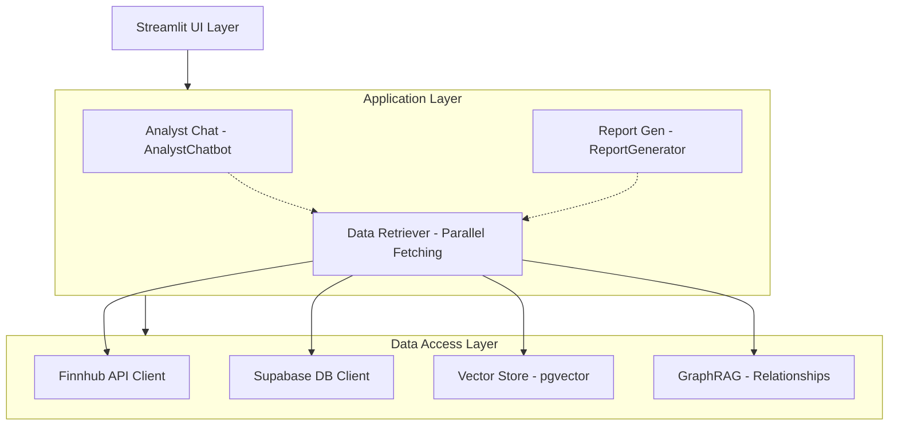

# 개발자 가이드 (Development Guide)

이 문서는 프로젝트의 기술적 구조와 확장 방법, 개발 시 유의사항을 담고 있습니다.

## 🏗️ 아키텍처 개요 (Architecture Overview)

### 시스템 구성도



## 🔨 새로운 기능 추가하기

### 1. 새로운 UI 페이지 추가

- `src/ui/pages/` 디렉토리에 새 파일을 생성합니다.
- `app.py`의 네비게이션 설정에 새 페이지를 추가합니다.

### 2. 새로운 데이터 소스(API) 추가

- `src/data/` 아래에 전용 클라이언트를 구현합니다.
- `src/rag/data_retriever.py`의 병렬 수집 로직에 통합하여 성능 저하를 방지합니다.

## 🔧 핵심 아키텍처 변화 (RAG Modularization)

### RAGBase 상속 구조

- 모든 RAG 관련 모듈(`AnalystChatbot`, `ReportGenerator`)은 `src/rag/rag_base.py`를 상속합니다.
- **OpenAI**, **Supabase**, **Finnhub** 및 **RAG 엔진** 초기화 로직이 공통화되어 있어 중복을 최소화합니다.

### 병렬 데이터 수집 (DataRetriever)

- `src/rag/data_retriever.py`는 `ThreadPoolExecutor`를 사용하여 멀티스레딩으로 데이터를 가져옵니다.
- DB 조회, 벡터 검색, 관계망 분석, 외부 API 호출을 동시에 수행하여 응답 속도를 극대화했습니다.

## 📊 데이터베이스 스키마 (Supabase)

### 주요 테이블 상세

- **companies**: 기업 기본 정보 (Ticker, Name, CIK, 로고 등)
- **annual_reports / quarterly_reports**: 연도별/분기별 재무 데이터
- **stock_prices**: 일일 주가 시세 (OHLCV)
- **company_relationships**: GraphRAG를 위한 기업 간 관계 데이터
- **documents**: 10-K 보고서 등의 텍스트 청크 (벡터 임베딩 저장)

## 🔧 설정 관리

### 환경 변수 (.env)

```env
OPENAI_API_KEY=...
SUPABASE_URL=...
SUPABASE_KEY=...
FINNHUB_API_KEY=...
```

### 모델 설정 (`models/settings.py`)

- 기본 모델(`gpt-4.1-mini`), 임베딩 모델(`text-embedding-3-small`) 및 파라미터를 중앙 집중식으로 관리합니다.

## 📝 코드 스타일 및 규칙

- **PEP 8** 준수: 변수명, 함수명 규칙을 따릅니다.
- **Type Hints** 사용: 함수의 입력과 출력 타입을 명시합니다.
- **Docstring**: 클래스와 주요 메서드에는 기능 설명을 작성합니다.

## 🐛 디버깅 및 로깅

- 모든 로그는 `config/logging_config.py` 설정을 따르며 콘솔에 기록됩니다.
- UI 디버깅 시 `st.write()` 또는 `st.sidebar.expander`를 활용하여 실시간 상태를 확인할 수 있습니다.
- 챗봇 응답 지연이 발생할 경우 `DataRetriever`의 스레드 할당 상태를 우선 확인하십시오.
